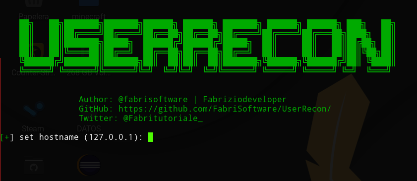
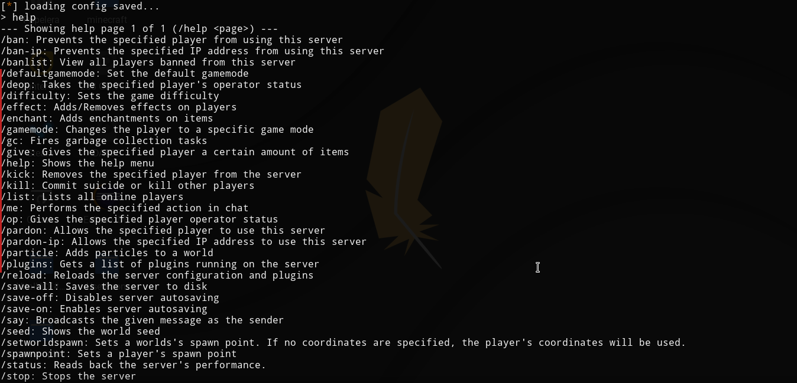

# UserRecon - remote connector

* Author #FF0000 | FabriSoftware
* Twitter: [@fabritutoriale_](https://twitter.com/fabritutoriale_)
* Discord: 0xFF0000#4940

### requirements

you must install python 3.x

install python on ubuntu

```
sudo apt-get update
sudo apt-get install python3 
```

if your using windows follow [this](https://www.python.org/downloads/) link.


to install required modules run the command
```
pip3 install -r requirements.txt
```

in linux or mac run


`./start.sh`

in windows

`start.bat`


### screenshots



